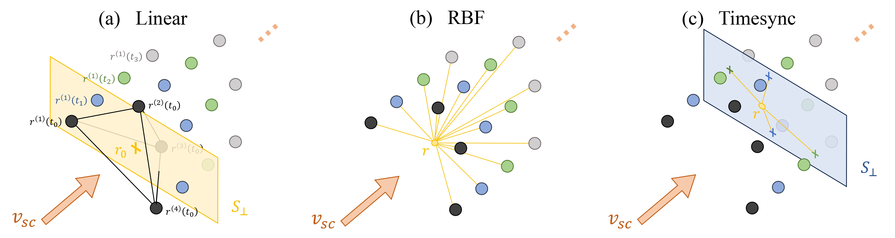
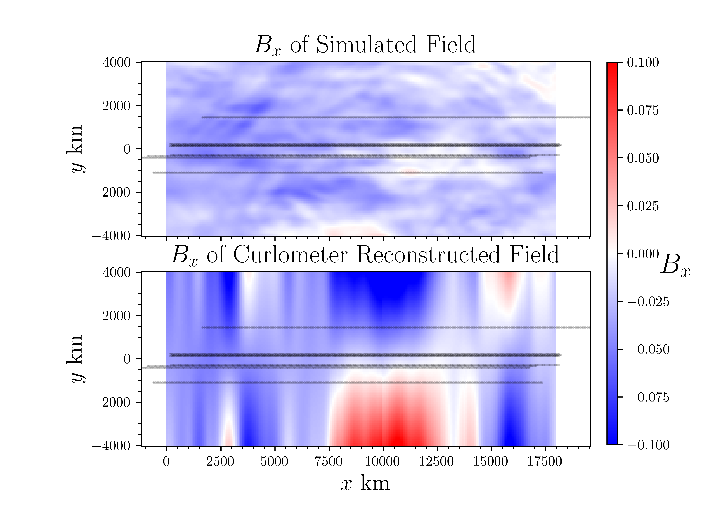
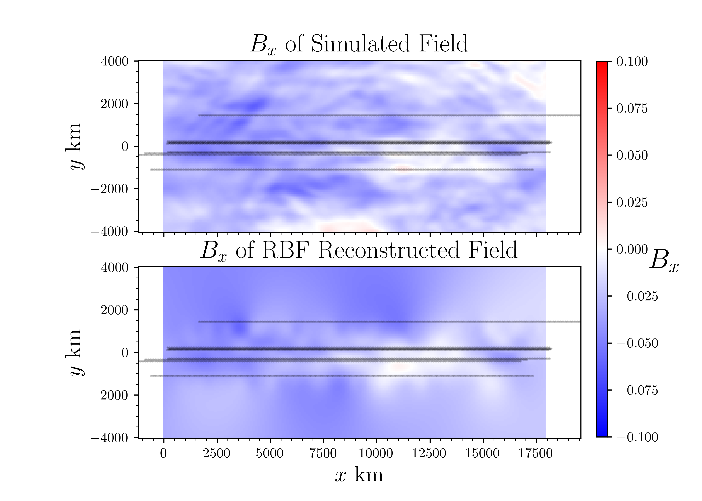
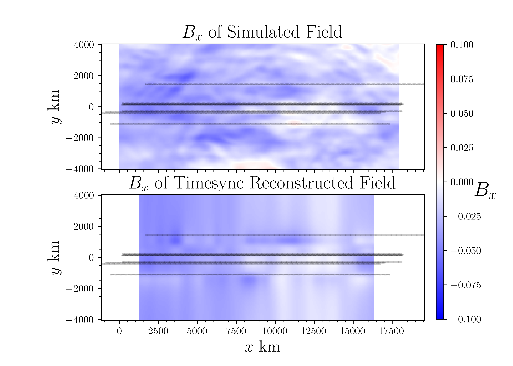

# B_Field_Reconstructions
We implement three mathematical techniques to reconstructed the magnetic field around a multispacecraft configuration taking sparse measurements: Curlometer, Radial Basis Function (RBF), and Timesync.

## Reconstruction Method Setups
The Curlometer method does not assume Taylor's hypothesis holds. It therefore scans through the timeseries of magnetic field measurements and uses tetrahedra drawn from measurements made at the same time to perform a reconstruction of the magnetic field near the barycenter of the configuration.

The RBF method assumes Taylor holds, and therefore uses all $NT$ measurements (from the $N$ spacecraft and $T$ points in time) to perform reconstructions. This method is dependent on selection of a kernel function and shape parameter $\sigma$. We use a multiquadric kernal with a shape parameter $\sigma$ selected using the optimal selection algorithm defined in [Rippa (1999)](https://doi.org/10.1023/A:1018975909870).

## Example Results
  
