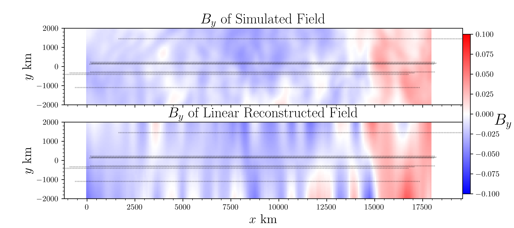
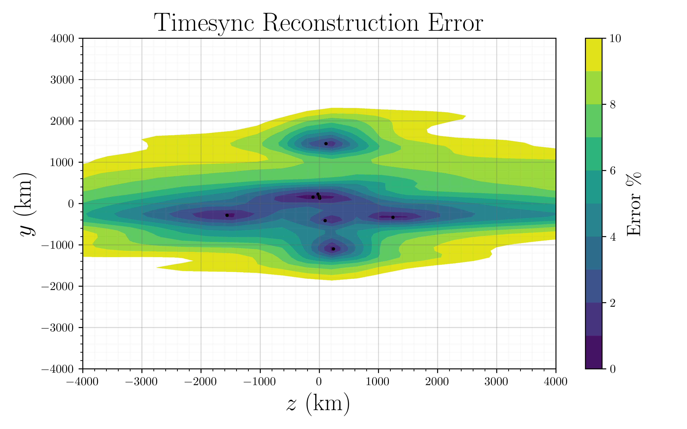

# Magnetic Field Reconstructions
We implement three mathematical techniques to reconstructed the magnetic field around a multispacecraft configuration taking sparse measurements: Linear, Radial Basis Function (RBF), and Timesync.

## Reconstruction Methods

### Linear Method
The Linear method does not assume Taylor's hypothesis holds. It therefore scans through the timeseries of magnetic field measurements and uses tetrahedra drawn from measurements made at the same time to perform a reconstruction of the magnetic field near the barycenter of the configuration. See the GitHub repo [Curlometer_Extension](https://github.com/broeren/Curlometer_Extension) for details on how the Linear method is applied to configurations of $N$ spacecraft.

 

### RBF
The RBF method assumes Taylor holds, and therefore uses all $NT$ measurements (from the $N$ spacecraft and $T$ points in time) to perform reconstructions. This method is dependent on selection of a kernel function and shape parameter $\sigma$. We use a multiquadric kernal with a shape parameter $\sigma$ selected using the optimal selection algorithm defined in [Rippa (1999)](https://doi.org/10.1023/A:1018975909870). This reconstruction/interpolation method can be interpreted as a simple neural network without regularization.

### Timesync
Timesync reconstruction is our own method of reconstructing magnetic fields. It computes the time/space offset of the measurements made by all of the spacecraft assuming Taylor's hypothesis holds. It then selects one measurement per spacecraft to be used in the interpolation scheme at any reconstructed point. This results in a reconstructed field that is interpolated separetly along the spacecraft's direction of travel and the plane perpendicular to this direction. This distinct treatment of the parallel and perpendicular directions was divised because spacecraft data is often well sampled in time, but poorly sampled in space. This inhomogeneous sampling is known to be non-optimal for the RBF method.

## Error in Methods
We compute the point-wise error in the reconstructed vs simulated magnetic field. We also demonstrate how to compute the relative Wasserstein distance $\overline{W}_d(B_x)$ for each field and report the median value, as well as 10-90% interval.

  

# References
This work is based on a paper that is currently under review. ([arXiv link](https://arxiv.org/abs/2310.15187))
